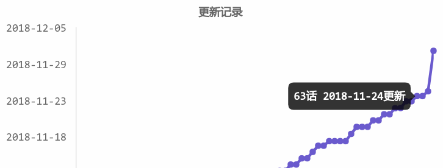

# dmzj update predict

[greasyfork](https://greasyfork.org/en/scripts/372890-bilibili%E4%B8%89%E8%BF%9E)	

- regression to predict next update time
- history update visualization

## structure

- 1.js tampermonkey entry
- indextf.html use tensorflow.js
- index.html use regression.js
- regression.js from [regression-js](https://github.com/Tom-Alexander/regression-js)
- f.js get comic's update to f.json
- findmax.js find max user id
- data.js get user's subscription

more apis, refer to [flutter_dmzj](https://github.com/tkkcc/flutter_dmzj/blob/master/lib/util/api.dart)

